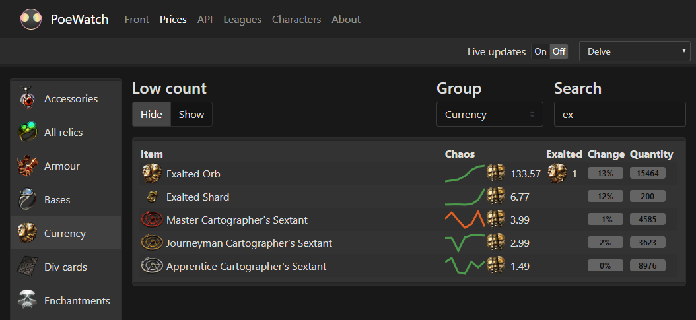

# PoeWatch

## Overview

PoeWatch is a Path of Exile statistics and price data collection page that's been in the works since 2017. It gathers data over time for various items (such as uniques, gems, currency, you name it) from public trade listings and finds the average prices.

The repository contains the web frontend, PHP backend and the app written in Java. A live version can be seen on [Poe.watch](http://poe.watch).

## The general idea

The general goal was to make a statistics website with everything in one place. Users can check prices of almost any item type from the current or past leagues and look up character names.

## Minimal setup

Prerequisites: Maven, the latest JDK and MySQL server.

1. Build Java app `mvn clean install`
2. Run db configuration script `resources/DatabaseSetup.sql`
3. Run app `java -jar poewatch.jar`
